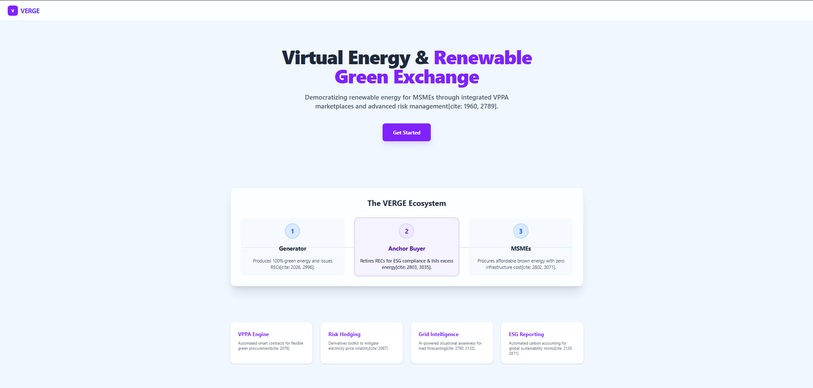
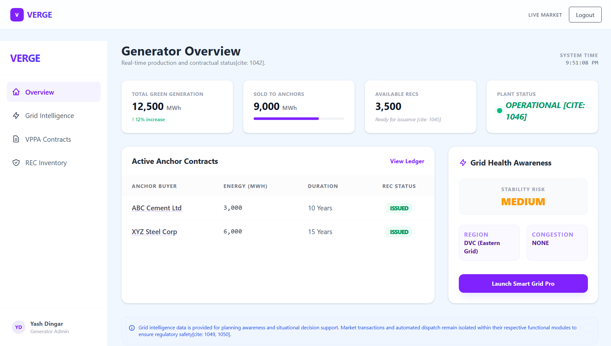
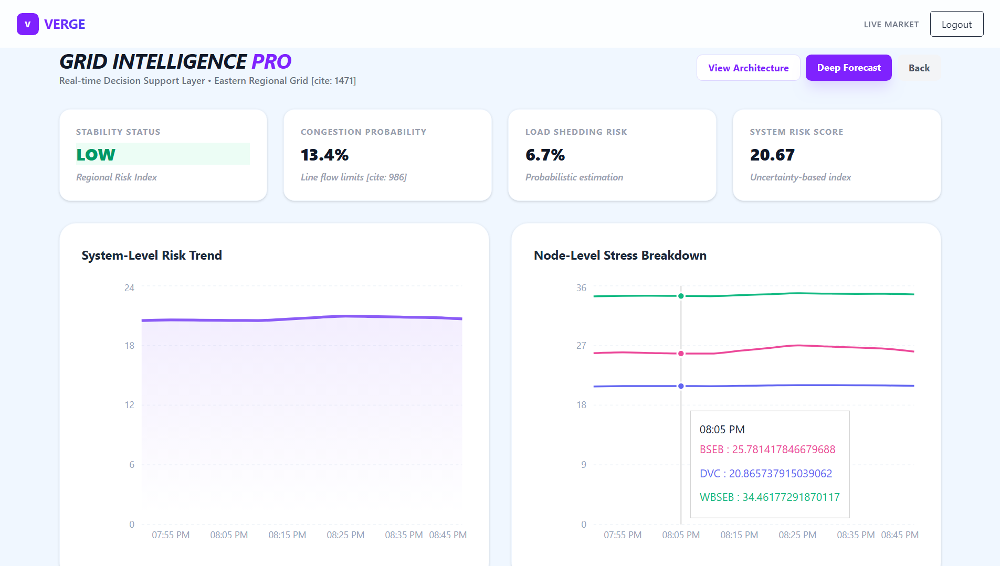
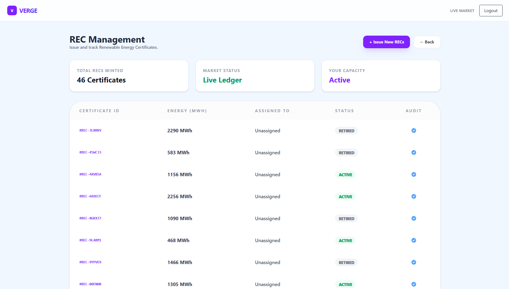

# VERGE — Virtual Energy & Renewable Green Exchange

A unified digital platform integrating renewable energy procurement, financial risk management, and grid intelligence into a scalable marketplace.

---

## Preview

---

## Overview

VERGE (Virtual Energy & Renewable Green Exchange) is designed to address the limitations of traditional renewable energy procurement, particularly for MSMEs.

Conventional models involve:
- High capital investment  
- Regulatory complexity  
- Exposure to volatile electricity prices  

VERGE replaces these with a unified digital system that combines:

- Virtual Power Purchase Agreements (VPPA)  
- Electricity derivatives for price hedging  
- Demand aggregation mechanisms  
- Capacitive backup power markets  
- Blockchain-based transparency  
- AI-driven grid intelligence  

The platform enables renewable procurement without infrastructure dependency while ensuring cost predictability and system stability.

---

## Key Features

### Unified Energy Marketplace
- Connects generators, MSMEs, and anchor buyers  
- Enables virtual renewable energy procurement  

### Integrated Risk Management
- Built-in derivatives for hedging price volatility  
- Predictable energy costs  

### Blockchain Transparency
- Smart contract execution  
- Immutable REC lifecycle tracking  

### Grid Intelligence Module
- Short-term demand forecasting  
- Real-time risk indicators  

### Capacitive Market Integration
- Backup energy activation during supply variability  
- Grid stability support  

---

## System Architecture

The platform follows a modular, multi-layered architecture:
- Core business logic layer  
- API and access control (RBAC)  
- Data and analytics layer  
- User interaction layer  

This ensures scalability, security, and interoperability.

---

## Grid Intelligence Architecture

The Grid Intelligence module operates as a non-intrusive analytical layer that provides:
- Probabilistic demand forecasting  
- Grid risk indicators  
- Congestion and stability analysis  

It enhances decision-making without interfering with market execution.

---

## Platform Interfaces

### Landing Page

---

### Generator Dashboard

- Tracks energy generation and contracts  
- Displays REC availability  
- Provides grid awareness  

---

### Grid Intelligence Dashboard

- Stability metrics  
- Risk scores  
- Real-time analytics  

---

### REC Management

- Certificate lifecycle tracking  
- Transparent compliance system  

---

### MSME Dashboard

- Consumption tracking  
- Cost optimization insights  

---

### Energy Marketplace

- Secondary energy trading  
- Market-driven pricing  

---

### Anchor Dashboard

- Portfolio management  
- Carbon offset tracking  

---

### VPPA Portfolio

- Contract tracking  
- Strike price and volume visibility  

---

## Workflow
